# Kong Gateway Golden Image Build Pipeline

## Overview

This repository contains the build pipeline for creating production-ready Kong Gateway golden images with environment-specific tagging. The pipeline builds secure, tested, and compliant container images that can be deployed across development, staging, and production environments.

## 🏗️ Build Process Architecture

```mermaid
graph TD
    A[🚀 Workflow Trigger] --> B[📥 Checkout Code]
    B --> C[🏷️ Generate Environment Tags]
    C --> D[🔧 Setup Build Tools]
    D --> E[🔐 Import Certificates]
    E --> F[📦 Download Kong Binary]
    F --> G[🏗️ Build Docker Image]
    G --> H[🔍 Security Scanning]
    H --> I[🐘 Start PostgreSQL]
    I --> J[🔄 Kong Database Migration]
    J --> K[🦍 Start Kong Gateway]
    K --> L[⚙️ Configure with Deck]
    L --> M[🧪 Run Smoke Tests]
    M --> N[⚡ Run Load Tests]
    N --> O[📤 Push to Registry]
    O --> P[🔍 Image Inspection]
    P --> Q[📊 Build Summary]
    
    style A fill:#e1f5fe
    style C fill:#f3e5f5
    style G fill:#e8f5e8
    style M fill:#fff3e0
    style N fill:#fff3e0
    style O fill:#e3f2fd
    style Q fill:#f1f8e9
```



## 🏷️ Environment-Specific Tagging Strategy

The pipeline generates **environment-aware tags only** to ensure clear separation between environments:

### Tag Format
```
{DOCKER_REGISTRY}/kong-gateway:{VERSION}-{ENVIRONMENT}
```

### Generated Tags by Environment

#### Development Environment
```bash
localhost:5000/kong-gateway:3.10.0.2-1.1-dev          # Semantic version with env
localhost:5000/kong-gateway:3.10.0.2-dev              # Kong version with env  
localhost:5000/kong-gateway:3.10-latest-dev           # Major.minor latest with env
```

#### Staging Environment
```bash
localhost:5000/kong-gateway:3.10.0.2-1.1-staging      # Semantic version with env
localhost:5000/kong-gateway:3.10.0.2-staging          # Kong version with env
localhost:5000/kong-gateway:3.10-latest-staging       # Major.minor latest with env
```

#### Production Environment
```bash
localhost:5000/kong-gateway:3.10.0.2-1.1-prod        # Semantic version with env
localhost:5000/kong-gateway:3.10.0.2-prod            # Kong version with env
localhost:5000/kong-gateway:3.10-latest-prod         # Major.minor latest with env
localhost:5000/kong-gateway:latest-prod              # Latest prod only
```

## 🚀 Quick Start

### Manual Workflow Execution

1. **Navigate to GitHub Actions** in your repository
2. **Select "Build Kong Golden Image"** workflow
3. **Click "Run workflow"** and configure:

| Parameter | Description | Default | Required |
|-----------|-------------|---------|----------|
| `kong_version` | Kong version to build | `3.10.0.2` | ✅ |
| `docker_registry` | Target registry | `localhost:5000` | ✅ |
| `org_patch_version` | Organization patch | `1` | ✅ |
| `environment` | Target environment | `dev` | ✅ |
| `continue_on_scan_failure` | Continue on scan failure | `true` | ❌ |

### Using the Built Image

```bash
# Pull the environment-specific image
docker pull localhost:5000/kong-gateway:3.10.0.2-1.1-dev

# Run Kong Gateway
docker run -d \
  --name kong-gateway \
  -p 8000:8000 \
  -p 8001:8001 \
  -e KONG_DATABASE=off \
  -e KONG_DECLARATIVE_CONFIG=/kong/declarative/kong.yml \
  localhost:5000/kong-gateway:3.10.0.2-1.1-dev
```
## 📁 Repository Structure

```
kong-golden-image/
├── .github/
│   └── workflows/
│       └── build-image.yaml          # Main build pipeline
├── certificates/
│   └── rootCA.crt                    # CA certificates
├── configs/
│   ├── kong.conf                     # Kong configuration
│   └── kong.yaml                     # Deck configuration
├── dockerfiles/
│   └── Dockerfile.debian             # Debian-based Dockerfile
├── scripts/
│   ├── docker-entrypoint.sh          # Container entrypoint
│   ├── kong-smoke-tests.bats         # Smoke test suite
│   └── security-hardening.sh         # Security hardening
├── tests/
│   └── k6/
│       └── load.js                   # Load testing script
└── reports/                          # Generated test reports
```

## 🔧 Build Pipeline Details

### Key Pipeline Features

- **🏷️ Environment-Specific Tagging**: All tags include environment suffix
- **🔐 Security Integration**: HashiCorp Vault for certificate management
- **🧪 Comprehensive Testing**: Smoke tests + Load tests + Health checks
- **🐘 Database Testing**: PostgreSQL integration with migrations
- **⚙️ Configuration Management**: Kong Deck for declarative config
- **📊 Detailed Reporting**: Build summaries and test reports

### Build Steps Breakdown

#### 1. Setup & Preparation
```yaml
- Checkout source code
- Setup Kong Deck CLI
- Configure Docker Buildx
- Setup testing tools (Bats, K6)
```

#### 2. Security & Certificates
```yaml
- Import CA certificates from HashiCorp Vault
- Save certificates to build context
- Apply security configurations
```

#### 3. Kong Binary Management
```yaml
- Download Kong Enterprise Edition
- Version: 3.10.0.2 (configurable)
- Source: packages.konghq.com
- Architecture: AMD64
```

#### 4. Image Building
```yaml
- Build from Debian base image
- Install Kong binary
- Apply custom configurations
- Set proper permissions
- Create non-root user
```

#### 5. Testing Infrastructure
```yaml
- Create isolated Docker network
- Start PostgreSQL container
- Wait for database readiness
- Run Kong database migrations
```

#### 6. Kong Gateway Testing
```yaml
- Start Kong with PostgreSQL backend
- Wait for Kong health checks
- Apply configuration with Deck
- Verify route availability
```

#### 7. Test Execution
```yaml
- Smoke Tests: Basic functionality validation
- Load Tests: Performance testing with K6 (50 VUs, 10s)
- Health Checks: All ports (8000, 8001, 8100, 8443, 8444)
```

#### 8. Publication & Reporting
```yaml
- Push multi-tagged image to registry
- Generate inspection reports
- Create detailed build summary
- Upload test artifacts
```

## 🧪 Testing Strategy

### Smoke Tests (BATS)
Located in `scripts/kong-smoke-tests.bats`

```bash
# Execute smoke tests
bats scripts/kong-smoke-tests.bats
```

**Test Coverage:**
- Kong binary installation
- Service startup and health
- Admin API responsiveness
- Proxy functionality
- Plugin availability
- Database connectivity

### Load Tests (K6)
Located in `tests/k6/load.js`

```bash
# Execute load tests
k6 run tests/k6/load.js
```

**Test Parameters:**
- Virtual Users: 50
- Duration: 10 seconds
- Endpoints: Admin API, Proxy API
- Thresholds: Response time and error rates

### Health Checks
- **Kong Health**: `kong health` command
- **Database**: PostgreSQL connectivity
- **Services**: All Kong ports accessible
- **Configuration**: Deck sync validation

## 🔐 Security Features

### Security Hardening
- Non-root user execution
- Minimal package installation
- Security patches applied
- Vulnerability scanning ready

### Certificate Management
- HashiCorp Vault integration
- CA certificate injection
- Secure certificate storage

### Access Control
- Private registry authentication
- Secrets management
- Environment separation

## 📊 Build Outputs

### Generated Artifacts
```
reports/
├── smoke_test_report.log         # BATS test results
├── load_test_report.json         # K6 performance results
└── security_scan_report.json     # Vulnerability scan results
```

### Build Summary Example
```
✅ Kong Golden Image Build Complete!
===========================================

📦 Build Details:
Kong Version: 3.10.0.2
Base Semantic Version: 3.10.0.2-1.1
Environment-Specific Semantic Version: 3.10.0.2-1.1-dev
Environment: dev
Registry: localhost:5000

🏷️ Tags Created:
  ✓ localhost:5000/kong-gateway:3.10.0.2-1.1-dev
  ✓ localhost:5000/kong-gateway:3.10.0.2-dev
  ✓ localhost:5000/kong-gateway:3.10-latest-dev

🧪 Tests Completed:
  ✓ Health checks for all ports (8000, 8001, 8100, 8443)
  ✓ Admin API integration tests
  ✓ Database connectivity tests
  ✓ Smoke tests with BATS
  ✓ Load tests with k6 (Proxy)

🚀 Usage:
docker pull localhost:5000/kong-gateway:3.10.0.2-1.1-dev
```

## 🔄 Maintenance & Updates

### Regular Updates
- **Weekly**: Security patch scans
- **Monthly**: Kong version updates
- **Quarterly**: Base image updates

### Version Management
```bash
# Semantic Version Format
{KONG_VERSION}-{ORG_PATCH}.{BUILD_NUMBER}-{ENVIRONMENT}

# Example: 3.10.0.2-1.245-prod
# Kong: 3.10.0.2
# Org Patch: 1
# Build: 245
# Environment: prod
```

### Upgrade Process
1. Update `kong_version` input parameter
2. Test in dev environment first
3. Promote through staging
4. Deploy to production

## 🚦 Monitoring & Alerts

### Build Monitoring
- Pipeline success/failure rates
- Build duration tracking
- Test execution metrics
- Image size monitoring

### Deployment Tracking
- Environment-specific deployments
- Version adoption rates
- Rollback frequency

## 🤝 Contributing

### Development Workflow
1. Create feature branch
2. Update Dockerfile/scripts
3. Test locally with `act`
4. Submit pull request
5. Automated testing runs
6. Review and merge

### Local Testing with Act
```bash
# Install act (GitHub Actions runner)
brew install act

# Run workflow locally
act workflow_dispatch \
  --secret-file act.secrets \
  --var kong_version=3.10.0.2 \
  --var environment=dev
```

## 📚 Documentation

### Related Resources
- [Kong Gateway Documentation](https://docs.konghq.com/gateway/)
- [Kong Docker Installation](https://docs.konghq.com/gateway/latest/install/docker/)
- [Kong Configuration Reference](https://docs.konghq.com/gateway/latest/reference/configuration/)
- [Deck Documentation](https://docs.konghq.com/deck/)

### Support
For questions or issues:
1. Check existing [GitHub Issues](https://github.com/your-org/kong-golden-image/issues)
2. Create new issue with detailed description
3. Contact DevOps team: devops@your-org.com

---

## 📈 Benefits Summary

✅ **Environment Isolation**: Clear separation with environment-specific tags  
✅ **Automated Testing**: Comprehensive validation before deployment  
✅ **Security First**: Integrated security scanning and hardening  
✅ **Database Ready**: Pre-tested PostgreSQL integration  
✅ **Production Ready**: Battle-tested build process  
✅ **Audit Trail**: Complete build and test reporting  

**Next Steps**: Clone this repository and run your first golden image build! 🚀